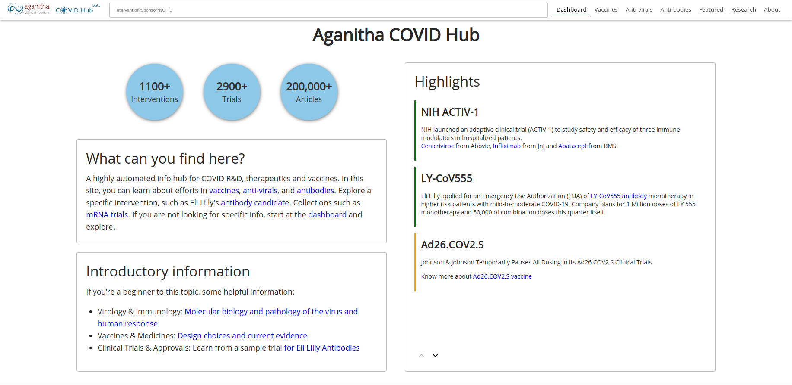

# Summary 
In March 2020, the COVID-19 pandemic caused by the transmission of severe acute respiratory syndrome coronavirus 2 (SARS-CoV2) was declared. It was first identified in December 2019 in Wuhan, China and became a Public Health Emergency of International Concern in January 2020. As of 25 October 2020, more than 42.6 million cases have been confirmed, with more than 1.15 million deaths attributed to COVID-19. [Source: *Wikipedia*] SARS CoV2 is an enveloped, positive sense single stranded RNA virus. It has a genome size of ~30 Kbp. To invade the host cell, the virus uses its surface protein known as the Spike (S) protein. S protein interacts with the host cell's ACE2 receptors, thereby infecting the cell and completing its life cycle. 

This portal is a highly automated information hub for COVID research, development, therapeutics and vaccines. In this site, you can learn about efforts in vaccines, anti-virals, and antibodies. You can explore a specific intervention, such as Eli Lilly's antibody candidate or even collections such as mRNA trials. If you are not looking for specific info, start at the dashboard and explore.  [ [Link to Portal](https://covid.aganitha.ai/) ]  

 