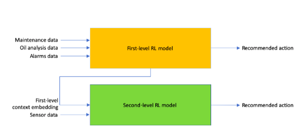

# Summary 
 
In this project, the primary objectives were to 
- learn and indicate the health of mission-critical equipment, 
- warn at an early stage in cases of low health, 
- prescribe maintenance tasks at appropriate times, and 
- achieve an overall cost-based optimization 

The data available to us was a combination of maintenance logs, per-component maintenance tasks, oil data, sensor alarms data and sub-system specific sensors' data. Further, it was spead over different durations (6 years, 2 years and some data values were only recorded for 2 months). 

One way to formulate predictive maintenance could be to classify the records into Red/Amber/Green (RAG) corrsponding to the status of health of the equipment. However, that would not ensure cost-based optimization and moreover the data was suffering from high class imbalance - which would have hurt the performance of the model. Another possible soultion could be to formulate it as a regression problem and aim to predict the RUL (Remaining Useful Life) of the equipment. But, corresponding ground truth labels were unavailable to train our models. 

Nevertheless, the problem could be intuitively formulated using a reinforcement learning setting. The aim was to maximize a cost-based reward function. Features like loss of production in downtime (direct and consequential) of equipment, costs of replacement and total possible yield (revenue) from production were used to design a single reward signal, using which an RL agent must determine when to call for maintenance tasks for the equipment based on its current health or state (values from the various sensors). We defined three maintenance regimes - Normal, Schedule, Immediate (NSI), in every life span of a sub-system/component. The RL agent is asked to recommend the action at every time step, starting from a random point in the lifespan. The model is rewarded if it recommends the right action at each time step, and is penalized otherwise. The 'game' ends if the model recommends an I, that is, an immediate maintenance. In case of an I, the agent is highly rewarded in case it acted during the right regime, otherwise it is heavily penalized. 

However, to overcome the hindrance due to data from different timelines, we divided the training of the RL agent into two stages. In the first stage, the agent is trained on the featurized data available for 2 and 6 years. Then, the remaining sensor records (corresponding to 2 months) were augmented with the learned embeddings (from stage I) to further learn (stage II) to predict maintenance tasks at appropriate times. (See figure) 

