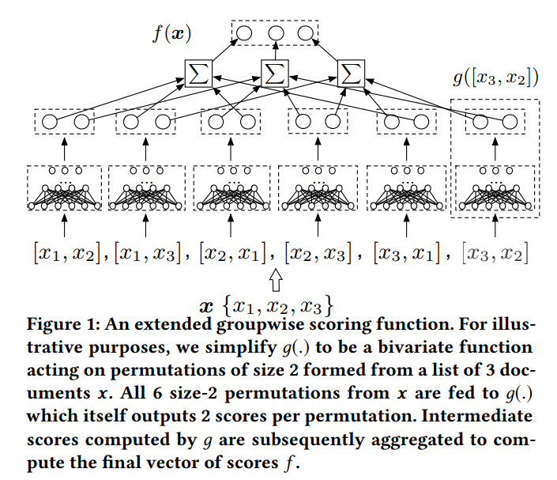

# Summary 
 

We developed a reaction ranking framework for chemical reactions. It was customized for one of the top-10 global bio-pharma players to develop specific models to rank Suzuki Coupling reactions. Structural properties of involved reactants, catalysts and products were used as features to train our models. Additional features incorporating Suzuki reaction mechanisms were also augmented to improve the performance. 

Compared to classification or regression settings where each reaction would require to be assigned an absolute class (like high-yileding or low-yielding) or a yield value, ranking settings bring in the notion of relative relevance between the data points. In this way, the the utility of the entire list of reactions is maximized. 

Furthermore, because we aimed to reducing unproductive chemical synthesis by omitting comparatively lesser yielding reactions rather than determining reactions with high/low (absolute) magnitudes of yields of reactions, the relevance of each reaction depended on the distribution of the entire list. We, hence, determine the relevance score of each reaction by comparing its features with that of the others in the list. We make use of Group-wise scoring functions (GSFs) to learn to score individual reactions in a list (relevant score) and using Monte Carlo sampling strategy, aim to reduce the complexity of GSFs. 

Using ranking models, we were able to claim that the bottom 30% of the reactions can be skipped during wet lab experimentation. Furthermore, we were ~95% confident that we will not miss the highest yielding reaction. This can lead to saving time, effort and material costs involved in the process. 

[ [Reference Paper](https://arxiv.org/pdf/1811.04415.pdf) ] 

