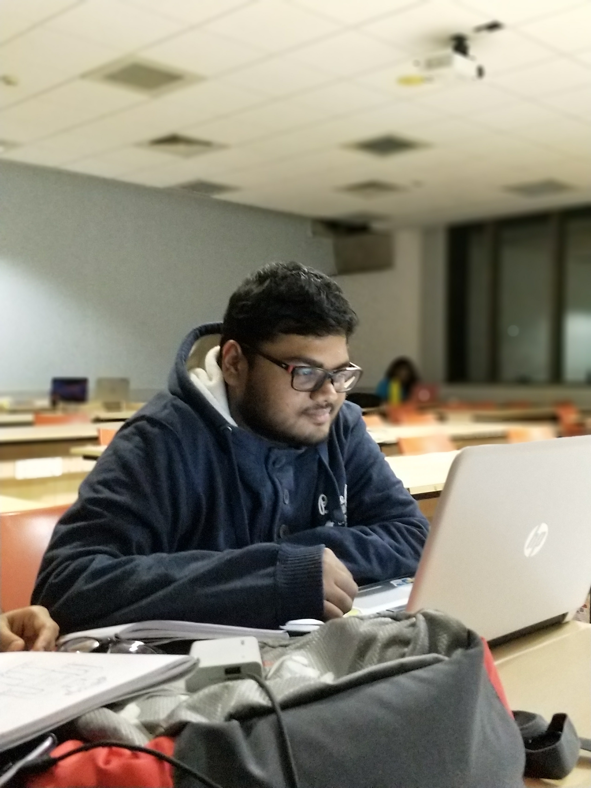
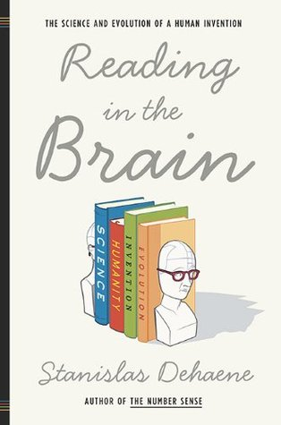
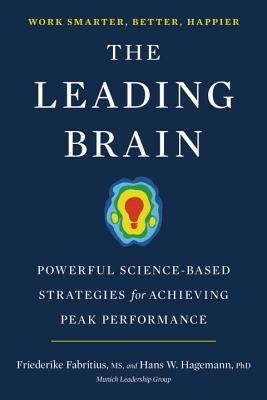
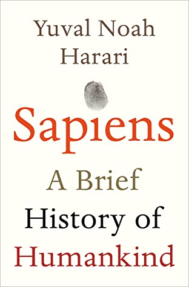
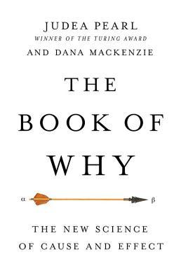
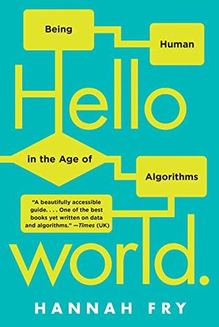
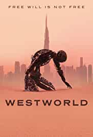
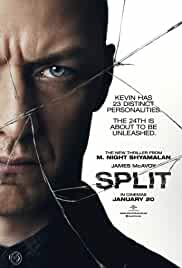
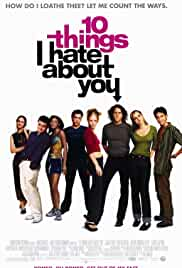
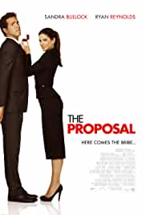

Apart from work, I enjoy spending my time in various other things like playing outdoors or watching some Sci-Fi thriller or drama series! I also enjoy reading books, mainly non-fiction! 

*Clicking on any of the links below will open a glimpse into my non-academic life. 

Sports
 

    <figure style="width:400px;height:600px;padding-right:100px;">
        
        <figcaption><b>Chess</b> has become my guilty pleasure now! In the picture, its me engrossed in playing online chess one fine day!</figcaption>
    </figure>
    <figure style="width:360px;height:480px;padding-right:100px;">
        
        <figcaption>This is a picture of me enjoing Badminton in IIIT-B's courts!</figcaption>
    </figure>

Books
 
Books with a look inside the <b>human brain</b>, <b>behavior</b>, <b>entrepreneurship</b>, <b>artificial intelligence</b> and <b>algorithms</b> that are shaping our lives and the dilemmas they bring with them are the ones that I find myself reading!  

  
  
  
  
  
  
   
  

 
Movies and TV Shows
 
I enjoy two very distinct genres of movies and TV shows -  
<b>Anachronistic Science-Fiction Thrillers</b> and <b>Melodramatic, Slice-of-Life, Romantic Comedies</b>! 

  
  
  
  

  
  
  
  

Travel

<iframe src="https://www.google.com/maps/d/u/0/embed?mid=1K_pJWcCvp50U3bYZ8vAemnUL1rqaSjNI" width="640" height="480"></iframe>

