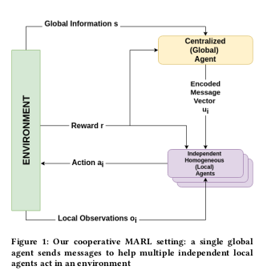

# Abstract

Cooperative multi-agent reinforcement learning (MARL) has achieved significant results, most notably by leveraging the representation-learning abilities of deep neural networks. However, large centralized approaches quickly become infeasible as the number of agents scale, and fully decentralized approaches can miss important opportunities for information sharing and coordination. Furthermore, not all agents are equal — in some cases, individual agents may not even have the ability to send communication to other agents or explicitly model other agents. This paper considers the case where there is a single, powerful, central agent that can observe the entire observation space, and there are multiple, low-powered, local agents that can only receive local observations and cannot communicate with each other. The central agent’s job is to learn what message to send to different local agents, based on the global observations not by centrally solving the entire problem and sending action commands, but by determining what additional information an individual agent should receive so that it can make a better decision. After explaining our MARL algorithm, hammer, and where it would be most applicable, we implement it in the cooperative navigation and multi-agent walker domains Empirical results show that 1) learned communication does indeed improve system performance, 2) results generalize to multiple numbers of agents, and 3) results generalize to different reward structures.

[ [Unofficial Preprint](https://www.dropbox.com/s/rpcz3gvmz8vqtpm/Hammer-preprint.pdf?dl=0) ]