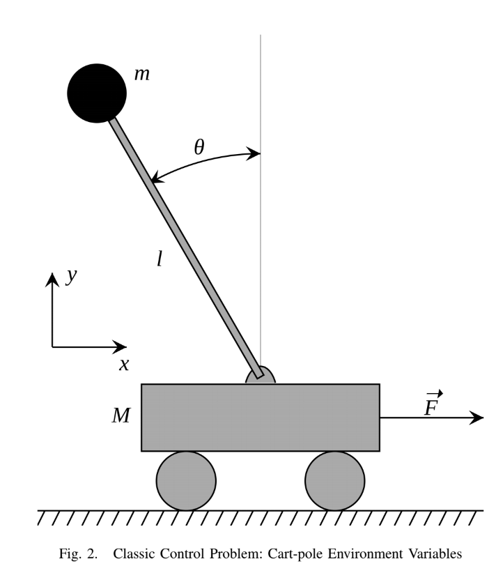

# Abstract
The cart-pole problem is a standard control problem. As explained by OpenAI Gym, the case is:- 

> ”A pole is attached by an un-actuated joint to a cart, which moves along a frictionless track. The system is controlled by applying an action of +1 or -1 to the cart. The pendulum starts upright, and the goal is to prevent it from falling over. A reward of +1 is provided for every timestep that the pole remains upright. The episode ends when the pole is more than 15 degrees from vertical, or the cart moves more than 2.4 units from the center."

We explored and designed various different types of reward signals for this problem and compared the agent's cumulative rewards accumulated over episodes. The types of reward signals can be abstractly described in the following categories: 
* Positive rewards 
* Negative rewards 
* Reward gradient 
* Variable Force 
* Force Gradient 

[ [Report](https://drive.google.com/file/d/0Bz-47WwEsrqLbkJJa1pmZmgxOVk/view) ] 