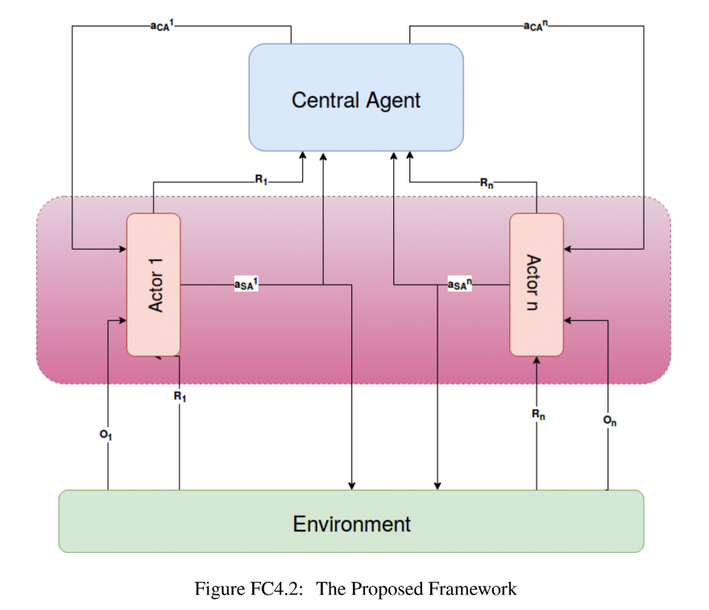

# Abstract
<!--  -->

Exploring and aiming to develop new methods for peer-to-peer teaching in cooperative multi-agent RL. We are at- tempting to enhance when and what to advise to improve local learning. [ Ongoing Work ] 

<!-- [Download thesis here](https://www.dropbox.com/s/aj94skskcqigf3h/thesis_final_draft.pdf?dl=0)  -->