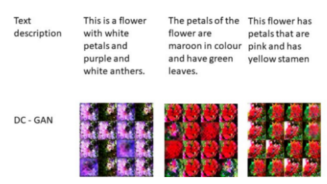

# Abstract

One of the most challenging problems in the world of Computer Vision is synthesizing high-quality images from text descriptions. No doubt, this is interesting and useful, but current AI systems are far from this goal. In recent years, powerful neural network architectures like GANs (Generative Adversarial Networks) have been found to generate good results. Samples generated by existing text-to-image approaches can roughly reflect the meaning of the given descriptions, but they fail to contain necessary details and vivid object parts. Through this project, we wanted to explore architectures that could help us achieve our task of generating images from given text descriptions. Generating photo-realistic images from text has tremendous applications, including photo-editing, computer-aided design, etc. 

[ [Report](https://github.com/Nikunj-Gupta/NNProject/blob/master/Report.pdf) ] [ [Code](https://github.com/Nikunj-Gupta/NNProject) ]